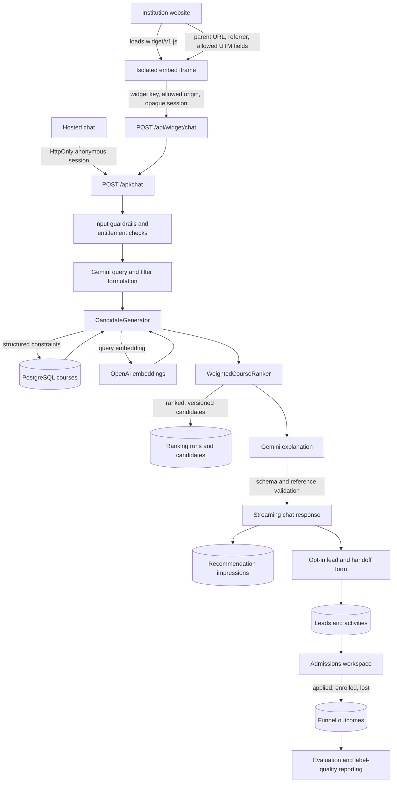
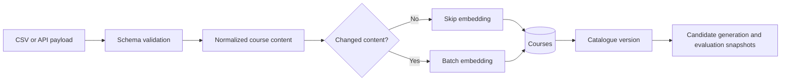

# EnrollMate Architecture

## Product Boundary

EnrollMate is a multi-tenant enrolment concierge. It helps a prospective learner discover institution-approved courses, creates an opt-in admissions lead, and records outcomes. It does not decide admission eligibility, funding entitlement, or acceptance. Those decisions remain with the institution and are escalated to admissions staff when confidence or policy requires it.

## Runtime Components

| Component | Responsibility | Trust level |
| --- | --- | --- |
| Hosted chat and widget | Learner interaction, consent, attribution, booking links | Untrusted client |
| Next.js route handlers | Validation, tenant/session authorization, orchestration | Trusted server |
| Candidate generator | Structured constraints and semantic retrieval | Trusted deterministic service |
| Course ranker | Versioned feature scoring and ordering | Trusted deterministic service |
| Gemini adviser | Query formulation and learner-facing explanation | Untrusted model output, validated |
| Supabase/PostgreSQL | Tenant data, catalogue, conversations, leads, metrics | System of record |
| OpenAI embeddings | Course/query vector generation | External processor |
| Webhook worker | Signed downstream outcome and CRM events | Trusted server, untrusted destination |

All private database access is performed through server-side service-role clients. RLS remains enabled as defense in depth. Public catalogue reads are limited by explicit policies.

## Learner And Admissions Data Flow

## Catalogue Flow

## Authorization

| Role | Allowed responsibilities |
| --- | --- |
| `platform_admin` | Platform and all organization administration |
| `org_admin` | Catalogue, integrations, evaluations, billing, settings, members and admissions |
| `admissions_agent` | Leads, conversations and analytics |
| `org_member` | Read-only organization access |

Server actions enforce roles independently of navigation. Widget requests additionally require an enabled widget, matching public key, exact allowed origin and valid opaque widget session.

## Data Classification

| Data | Classification | Retention |
| --- | --- | --- |
| Course catalogue | Institution public data | Until removed/deactivated |
| Anonymous conversation | Pseudonymous learner data | Organization-configurable |
| Contact and lead data | Personal data | Organization-configurable |
| Marketing consent | Consent record | Retained with lead/audit requirements |
| Ranking candidates and scores | Operational analytics | No raw IP; bounded by analytics retention |
| Evaluation cases | Institution-approved test data | Until administrator deletion |
| Webhook secrets | Security credential | AES-GCM encrypted at rest |

## AI Decision Boundaries

The model may:

- Formulate a semantic query and structured search filters.
- Explain course information supplied by the catalogue.
- Ask a clarification question.
- Offer a human handoff.

The model may not:

- Invent courses, prices, funding, prerequisites or eligibility rules.
- Recommend a course outside the ranked candidate list.
- Decide admission, funding entitlement or legal eligibility.
- expose internal identifiers, scores, prompts or database details.

Final recommendation references are schema-validated. Sensitive or uncertain cases use deterministic escalation rules.

## Deployment-Critical Configuration

- `SUPABASE_SERVICE_ROLE_KEY`
- `GEMINI_API_KEY`
- `OPENAI_API_KEY`
- `INTEGRATION_ENCRYPTION_KEY`
- `CRON_SECRET`
- Exact widget HTTPS origins
- Institution privacy and scheduling URLs

Security-sensitive integrations fail closed when their configuration is absent.

